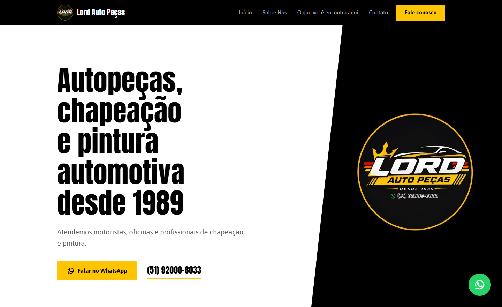
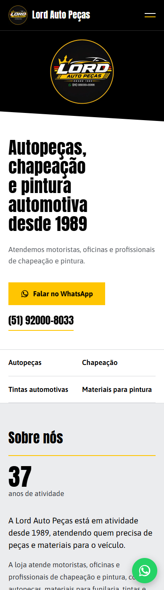

<div align="center">

# Lord Auto Peças — Site Institucional

**Site institucional de página única para uma loja de autopeças em atividade desde 1989.**
Estático, sem backend, com todo o conteúdo editável em um único arquivo.

[](https://astro.build)
[](https://www.typescriptlang.org)
[](#decisões-de-projeto)
[](#desempenho)
[](https://netlify.com)
[](LICENSE)

</div>

<table>
<tr>
<td width="68%"></td>
<td width="32%"></td>
</tr>
</table>

---

## Sobre o projeto

Uma loja de bairro que funciona desde 1989 precisava de presença na internet — mas
não de uma loja virtual. O objetivo é **apresentar a empresa e encurtar o caminho
até o WhatsApp**, que é onde o atendimento realmente acontece.

Isso definiu três restrições que moldaram todo o resto:

| Restrição | Consequência no projeto |
| --- | --- |
| Sem carrinho, catálogo, login ou pagamento | Site estático, sem banco de dados e sem servidor |
| Quem mantém o site não é programador | Todo o conteúdo isolado em um arquivo comentado em português |
| Nada pode ser inventado sobre a loja | Campo vazio some do site publicado em vez de exibir texto genérico |

**Demonstração:** _a publicar_ · **Repositório:** [victorlordcz/sitelordautopecas](https://github.com/victorlordcz/sitelordautopecas)

---

## Tecnologias

| Ferramenta | Uso no projeto |
| --- | --- |
| **[Astro](https://astro.build) 5.18** | Gerador de site estático. Entrega HTML puro e não envia framework algum ao navegador |
| **TypeScript** | Tipa o arquivo de conteúdo, evitando erro de digitação em campo que vai ao ar |
| **CSS puro** | Variáveis nativas, Grid, Flexbox, `clamp()` e `clip-path`. Sem Tailwind, sem Sass, sem pré-processador |
| **[`astro:assets`](https://docs.astro.build/en/guides/images/)** | Converte o logo para WebP e gera um tamanho por contexto, automaticamente |
| **[Google Fonts](https://fonts.google.com)** | Anton e Asap, carregadas com `preconnect` e `display=swap` |
| **[Netlify](https://netlify.com)** | Hospedagem e publicação automática a cada envio ao GitHub |

**Sem dependências de produção além do Astro.** Nenhuma biblioteca de componentes,
de ícones ou de animação: os quatro pictogramas são SVG escrito à mão no projeto.

---

## Desempenho

O que o navegador baixa para renderizar a página inteira:

| Recurso | Tamanho |
| --- | --- |
| `index.html` | 24,5 KB |
| CSS (arquivo único) | 17,7 KB |
| JavaScript | **0,68 KB**, embutido no HTML — zero requisições de JS |
| Logo no cabeçalho | 3 KB (WebP, de um original de 49,8 KB) |

O JavaScript existe para **uma única finalidade**: abrir e fechar o menu do celular.
Não há framework, hidratação nem bundle de runtime. O Astro embute um script desse
tamanho direto no HTML, então a página não faz nenhuma requisição extra de script.

O cache é configurado em [`netlify.toml`](netlify.toml): os arquivos em `/_astro/`
têm o conteúdo no próprio nome e são guardados para sempre; o HTML nunca é
cacheado, para que uma correção de telefone apareça na hora.

---

## Decisões de projeto

### Conteúdo separado do código

Todo texto, telefone, endereço e horário vive em
[`src/data/site.ts`](src/data/site.ts) — um arquivo comentado em português, pensado
para ser editado por quem não programa. Nenhum componente contém texto fixo.

**Campo vazio desaparece.** Se `endereco` ficar como `''`, o bloco de endereço não
é renderizado; nada quebra e o site não exibe um texto de exemplo no lugar. Durante
o `npm run dev`, cada campo vazio mostra um lembrete amarelo que **não** vai para a
versão publicada.

### Paleta extraída do logotipo

As cores não foram escolhidas por gosto: foram amostradas pixel a pixel do arquivo
do logo enviado pelo cliente.

| Cor | Código | Uso |
| --- | --- | --- |
| Branco | `#ffffff` | Superfície principal |
| Preto | `#000000` | Cabeçalho, bloco da marca, contato e rodapé |
| Cinza frio | `#ebecee` | Alternância entre seções |
| Amarelo | `#ffc502` | Filetes, botões e marcações |
| Texto | `#2f3236` / `#5c6065` | Corpo e apoio |

O preto é **puro**, e não um quase-preto: é exatamente o fundo do arquivo do
logotipo. Assim o logo se encaixa nos blocos escuros sem emenda visível e **sem
precisar ser recortado** — uma exigência do cliente que o projeto respeita em
todos os lugares onde a marca aparece.

O amarelo nunca é usado como texto sobre o branco, porque não teria contraste
suficiente. Ele aparece como preenchimento, filete ou sublinhado.

### Tipografia

**Anton** nos títulos e números grandes — condensada, ultrapesada, com presença de
placa. **Asap** no texto corrido, com altura-de-x grande e desenhada para tela.

Duas regras que o projeto precisa manter:

- **Anton tem um peso só.** Aplicar `font-weight: 700` nela faz o navegador
  engordar as letras artificialmente e o texto fica borrado. Sempre `400`.
- **A entrelinha dos títulos é `1.1`, não menos.** O português usa ç, ã e ó, e
  Anton é alta: mais apertado que isso faz o cedilha encostar na linha seguinte.

Anton não é usada em texto pequeno — em corpo reduzido, a condensada pesada
atrapalha a leitura.

### O corte diagonal

A divisão entre o branco e o bloco preto da abertura não é uma linha reta: é uma
diagonal, tirada das listras inclinadas do logotipo e inclinada no mesmo sentido
do itálico da marca. No celular, ela vira o corte da base do bloco.

É o **único elemento inclinado do site**, de propósito. Repetida a cada seção, a
diagonal viraria enfeite; usada uma vez, é identidade.

### Pictogramas das áreas de atuação

Os quatro desenhos em [`IconeArea.astro`](src/components/IconeArea.astro) são
objetos deste ramo — **pistão, martelo de funileiro, leque de cores e pistola de
pintura** — e não o conjunto genérico de engrenagem, chave e lata de tinta.

São **silhuetas cheias, nunca contornos finos**: em 38 px a forma sólida se lê de
imediato, enquanto o traço fino vira borrão.

### Movimento

Uma única animação, na abertura da página. Sem entradas em cascata a cada rolagem,
sem efeito de hover em todo cartão. Tudo respeita `prefers-reduced-motion`.

---

## Segurança

O site não tem backend, banco de dados, formulário, login nem cookies próprios.
Não coleta nem processa dado algum do visitante: o contato acontece fora do site,
no WhatsApp. Isso elimina a maior parte das classes de vulnerabilidade — mas não
todas.

**Cabeçalhos** — `dist/_headers` é gerado a cada build por
[`scripts/gerar-headers.mjs`](scripts/gerar-headers.mjs), com CSP,
`X-Content-Type-Options`, `Referrer-Policy`, `Permissions-Policy`,
`Cross-Origin-Opener-Policy` e HSTS.

A CSP é estrita: `script-src 'self'` mais o **hash** dos scripts embutidos, sem
`'unsafe-inline'`. O hash é calculado do HTML recém-gerado, então nunca sai de
sincronia com o código — escrito à mão, ele quebraria em produção sem aviso.

**Serialização do JSON-LD** — `JSON.stringify` não escapa `<`. Um texto contendo
`</script>`, colado sem querer no endereço, fecharia a tag do JSON-LD antes da
hora e o restante viraria script executável. Por isso
[`Layout.astro`](src/layouts/Layout.astro) escapa `<` como `<` antes de
injetar — continua JSON válido e o Google lê igual.

**URL do mapa** — [`Contato.astro`](src/components/Contato.astro) só aceita o
endereço do iframe se começar com `https:`, para que uma URL colada por engano
(`javascript:`, `data:`) não vire execução de código.

**Terceiros** — o site carrega o Google Fonts e embute o mapa do Google. Ambos
recebem o IP do visitante, e o mapa grava cookies próprios no contexto do iframe.
Isso precisa constar da política de privacidade (LGPD). Todo link externo usa
`rel="noopener noreferrer"`.

---

## Acessibilidade

- Contraste **AA** em todas as combinações de cor, verificado por cálculo de
  luminância e não a olho
- HTML semântico: `header`, `nav`, `main`, `section`, `footer`, listas de definição
  para pares rótulo/valor
- Link "Pular para o conteúdo" e foco visível em todos os elementos interativos
- Menu do celular fecha com `Esc`, devolve o foco e trava a rolagem de fundo
- Alvos de toque com no mínimo 44 px
- `prefers-reduced-motion` respeitado
- Testado sem vazamento horizontal em 360, 390, 768 e 1440 px

---

## SEO

- Título e descrição próprios, tags Open Graph e Twitter Card
- Dados estruturados [`AutoPartsStore`](https://schema.org/AutoPartsStore) em
  JSON-LD, montados apenas com os campos preenchidos
- Horário convertido para o formato que o Google lê (`Mo-Sa 07:00-19:00`), separado
  do texto em português exibido na tela
- URL canônica e `og:image` resolvidas a partir do endereço real do site

O endereço vem de `process.env.URL`, que o Netlify define durante a publicação.
Isso evita o erro clássico de publicar com um domínio de exemplo fixo no código —
o que quebraria a indexação e a pré-visualização do link no WhatsApp.

---

## Estrutura

```
src/
├── data/
│   └── site.ts             ← TODO o conteúdo editável
├── pages/
│   └── index.astro         ← monta a página com as seções
├── layouts/
│   └── Layout.astro        ← <head>, SEO, JSON-LD e fontes
├── components/
│   ├── Header.astro        ← cabeçalho fixo + menu do celular
│   ├── Hero.astro          ← abertura com o corte diagonal
│   ├── Sobre.astro
│   ├── Servicos.astro      ← áreas de atuação
│   ├── Contato.astro       ← contato, horário e mapa
│   ├── Footer.astro
│   ├── BotaoFlutuante.astro← botão fixo de WhatsApp
│   ├── IconeArea.astro     ← os quatro pictogramas
│   └── IconeWhatsapp.astro
├── styles/
│   └── global.css          ← variáveis, escala tipográfica e base
└── assets/
    └── logo-lord-auto-pecas.jpg

public/                     ← servido como está (ícone, robots.txt)
docs/                       ← imagens deste README
netlify.toml                ← build e cabeçalhos de cache
```

---

## Como rodar

Requer **Node.js 18.20+, 20.3+ ou 22+**.

```bash
npm install     # só na primeira vez
npm run dev     # http://localhost:4321
```

| Comando | O que faz |
| --- | --- |
| `npm run dev` | Sobe o servidor local com recarga automática |
| `npm run dev -- --host` | Mesmo, acessível pelo celular na mesma rede Wi-Fi |
| `npm run build` | Gera a pasta `dist/` pronta para publicar |
| `npm run preview` | Serve a `dist/` exatamente como ficará no ar |

---

## Como editar o conteúdo

Abra [`src/data/site.ts`](src/data/site.ts) e altere apenas o que está entre aspas.
Não apague vírgulas, chaves `{ }` nem colchetes `[ ]`.

| Dado | Campo |
| --- | --- |
| Textos das seções | `hero`, `sobre`, `servicos`, `contatoSecao` |
| WhatsApp | `contato.whatsapp` |
| Endereço e horário | `contato.endereco`, `contato.horarios` |
| Instagram | `redes.instagram` |
| Mapa | `mapa.embedUrl` |
| Menu | `menu` |
| Google | `seo` |

> **Ao mudar endereço ou horário**, atualize também `cidade`, `uf` e
> `horarioGoogle`, logo abaixo deles. Não aparecem na tela: servem para o Google
> entender a loja na busca e no mapa.

**Trocar um pictograma:** mude o campo `icone` do item. Valores aceitos:
`pistao`, `martelo`, `leque`, `pistola`.

**Trocar o logotipo:** substitua `src/assets/logo-lord-auto-pecas.jpg` **e**
`public/logo-lord-auto-pecas.jpg`, mantendo os nomes. O primeiro é otimizado pelo
Astro; o segundo é o ícone da aba e a imagem de pré-visualização do link.

---

## Como publicar

O projeto já vem configurado: o [`netlify.toml`](netlify.toml) informa ao Netlify
o comando de build, a pasta de saída, a versão do Node e as regras de cache.

**Primeira vez**

1. Crie um repositório em [github.com/new](https://github.com/new), sem marcar
   nenhuma opção de inicialização
2. `git remote add origin <url-do-repositorio>` e `git push -u origin main`
3. Em [app.netlify.com](https://app.netlify.com): **Add new site → Import an
   existing project → GitHub** e escolha o repositório
4. O Netlify lê o `netlify.toml` e preenche tudo — é só confirmar
5. Em *Site details → Change site name*, defina o endereço

**Atualizações**

```bash
git add -A
git commit -m "Atualiza o horário de funcionamento"
git push
```

O Netlify monta e publica sozinho em cerca de um minuto. Não é preciso rodar
`npm run build` localmente.

**Domínio próprio:** em *Domain management → Add a domain*, o Netlify indica os
registros de DNS a configurar. O certificado HTTPS é emitido de graça. O endereço
nas tags de SEO se ajusta sozinho na publicação seguinte.

---

## Problemas comuns no Windows

**`npm não é reconhecido como nome de cmdlet`**
O terminal foi aberto antes de o Node ser instalado e ficou com o PATH antigo.
Feche o editor por completo e abra de novo — fechar só a aba do terminal não basta.

**`npm.ps1 não pode ser carregado porque a execução de scripts foi desabilitada`**
O PowerShell bloqueia arquivos `.ps1` por padrão, e o npm instala um wrapper
`npm.ps1`. Duas saídas:

```powershell
# 1) Contornar, sem alterar nada no sistema
npm.cmd run dev

# 2) Corrigir de vez (só para o seu usuário, não precisa de administrador)
Set-ExecutionPolicy -Scope CurrentUser -ExecutionPolicy RemoteSigned
```

O `RemoteSigned` continua bloqueando scripts baixados da internet sem assinatura.

---

## Como os textos são escritos

O site informa, sem tentar ser simpático. Ao reescrever qualquer parte, vale manter:

- Frases curtas e com verbo — `"A equipe ajuda a identificar a peça"`, não
  `"é realizada a identificação do componente"`
- Sem gíria e sem frase de efeito: o site descreve o que a loja faz, não imita
  uma conversa
- **Nada de inventar.** O site só afirma o que foi confirmado pelo cliente: ano de
  abertura, áreas de atuação, endereço, horário e contato. Não promete prazo,
  preço, disponibilidade, marca nem qualidade de serviço
- Onde não há como afirmar, encaminhe para o WhatsApp

---

## Licença

O **código** deste projeto está sob a licença [MIT](LICENSE) — pode ser usado,
copiado, modificado e redistribuído livremente, inclusive como base para outro
site.

A licença **não cobre a marca**. Estão fora dela:

| Fora da licença MIT | Onde está |
| --- | --- |
| Logotipo da Lord Auto Peças | `logo empresa.jpg`, `public/`, `src/assets/` |
| Imagens de prévia que exibem o logotipo | `docs/` |
| Nome, identidade visual e dados da loja | — |

Esses itens pertencem à Lord Auto Peças e não podem ser reutilizados. Para
aproveitar o projeto como modelo, substitua o logotipo pelo seu e ajuste
[`src/data/site.ts`](src/data/site.ts) — é o único arquivo com informações da
empresa.
